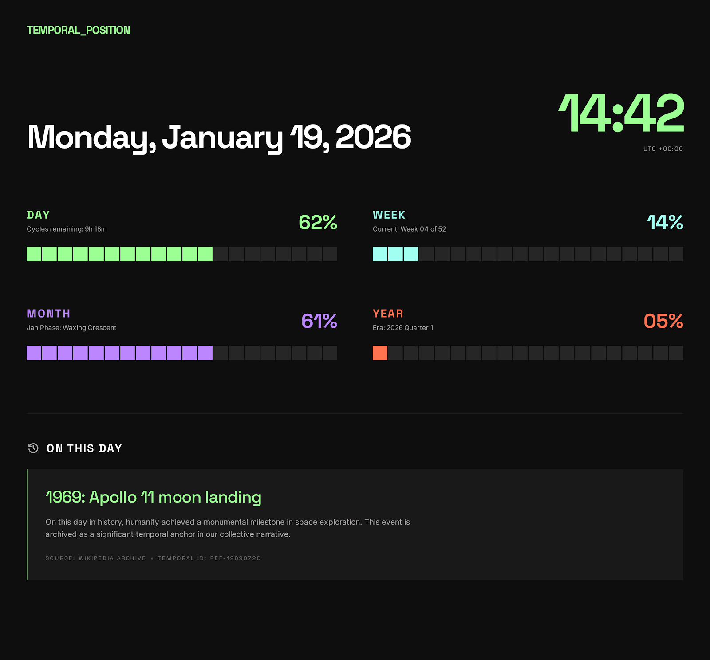

# Temporal Position

A minimalist time tracker that visualizes your position within different temporal cycles - day, week, month, and year. Built with the "Digital Zen" design philosophy featuring a dark, monolithic aesthetic with vibrant accent colors and zero rounded corners.

## Features

- **Real-time Clock**: Live updates showing current time with timezone offset
- **Progress Tracking**: Visual progress bars for:
  - Day (24-hour cycle with remaining time)
  - Week (7-day cycle with week number)
  - Month (calendar days with moon phase metaphor)
  - Year (12-month cycle with quarter tracking)
- **Historical Events**: "On This Day" section powered by Wikipedia API
- **Responsive Design**: Optimized for desktop, tablet, and mobile devices
- **Zero Dependencies**: Pure HTML, CSS, and JavaScript

## Design System

The interface follows the "Digital Zen" design philosophy:
- **No rounded corners** - All elements use 0px border-radius
- **Tonal layering** - Depth created through background color shifts, not borders
- **Color-coded periods** - Each time period has a unique accent color:
  - Day: Electric Green (#9cff93)
  - Week: Digital Cyan (#a0fff0)
  - Month: Ethereal Violet (#bc87fe)
  - Year: Coral Red (#ff6b4a)
- **Typography** - Space Grotesk for display/metrics, Inter for body text
- **Generous spacing** - Embracing negative space for clarity

## Live Demo

[View Live Demo](https://vabs.github.io/temporal-position/)

## Screenshots



## Local Development

1. Clone the repository:
```bash
git clone https://github.com/vabs/temporal-position.git
cd temporal-position
```

2. Open `index.html` in your browser:
```bash
open index.html
```

No build process required - it's pure HTML/CSS/JS!

## GitHub Pages Deployment

1. Push your code to GitHub
2. Go to repository Settings → Pages
3. Select "Deploy from a branch"
4. Choose `main` branch and `/ (root)` folder
5. Click Save

Your site will be live at `https://vabs.github.io/temporal-position/`

## Browser Support

- Chrome/Edge (latest)
- Firefox (latest)
- Safari (latest)

## API Usage

This project uses the [Wikimedia API](https://api.wikimedia.org/) to fetch historical events. No API key required.

## License

MIT License - feel free to use and modify as needed.

## Credits

Design system inspired by brutalist and terminal aesthetics. Historical data provided by Wikipedia.
